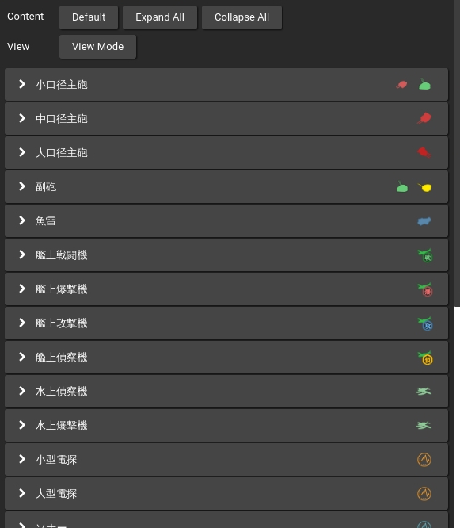
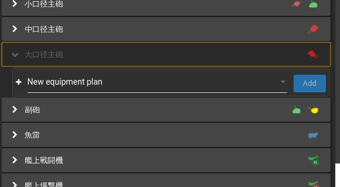
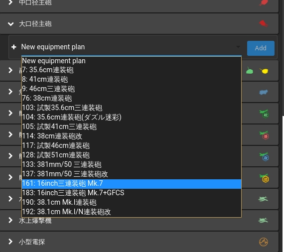
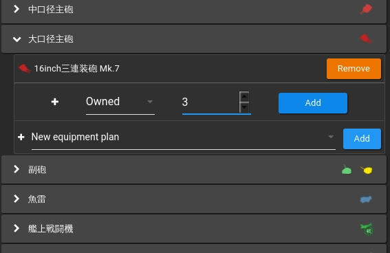
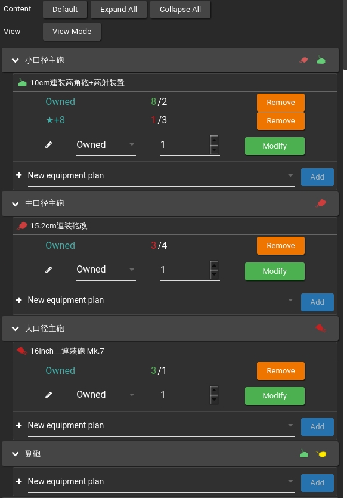
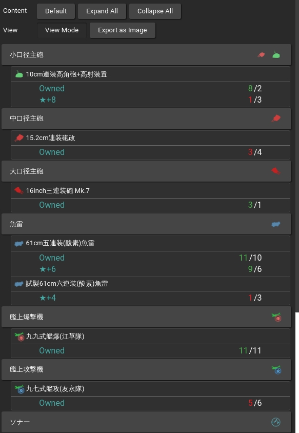

# Starcraft: Your personal planner for crafting stars

Starcraft is a [poi](https://github.com/poooi/poi) plugin that helps
you plan equipment farming and improvement.

## Changelog

### 1.0.0

- Deprecated in favor of [plugin-item-improvement](https://github.com/poooi/plugin-item-improvement)
- [Click here for details](https://github.com/poooi/poi-plugin-starcraft/blob/master/DEPRECATED.md)

### 0.0.1

- Improved image exporting

## How to Use

- Open Starcraft.

- Find and expand an equipment category.

- Add an equipment to your plan list.

- Edit your plans for that equipment.

- Add as many plans as you like

- Switch to "View Mode" for a clear view of all your plans

- Export your plan, share it with your friends, for asking for advice, or just showing off.

- Happy starcrafting!
